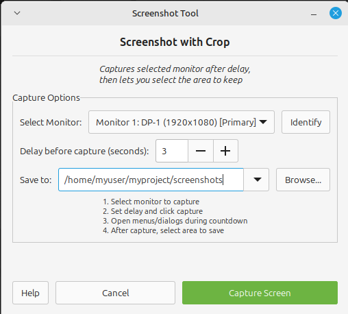

# Screenshot Crop Tool

A powerful yet simple screenshot tool for Linux with monitor selection, cropping capabilities, and project folder management.




## Features

### 📸 Core Screenshot Features
- **Monitor Selection**: Choose which monitor to capture in multi-monitor setups
- **Visual Crop Interface**: Drag to select the exact area you want to save
- **Delay Timer**: Set a delay (0-10 seconds) to prepare your screen before capture
- **Full Monitor Capture**: Option to save the entire selected monitor (Ctrl+S)

### 🖥️ Multi-Monitor Support
- **Monitor Identification**: Visual overlay showing monitor numbers on each screen
- **Per-Monitor Capture**: Capture only the selected monitor, not all screens
- **Monitor Information**: Shows monitor model, resolution, and primary status

### 📁 Project Folder Management
- **Persistent Folder Storage**: Remembers your last used folder between sessions
- **Recent Folders Dropdown**: Quick access to your last 10 project folders
- **Custom File Naming**: Name each screenshot appropriately for documentation
- **Folder Browser**: Create new folders directly from the browse dialog

### 🎯 User Experience
- **Keyboard Shortcuts**:
  - `Enter`: Save selected area
  - `Escape`: Cancel crop operation
  - `Ctrl+S`: Save full monitor screenshot
- **Failsafe Exit**: Press Escape 3 times quickly if the crop window becomes unresponsive
- **Visual Feedback**: Crosshair cursor and on-screen instructions during cropping
- **Workflow Optimized**: "Continue" button for rapid sequential screenshots

## Installation

### Prerequisites
- Python 3.8 or higher
- GTK 3.0
- Python GObject Introspection bindings

### Install Dependencies

#### Ubuntu/Linux Mint/Debian:
```bash
sudo apt-get install python3-gi python3-gi-cairo gir1.2-gtk-3.0 gir1.2-gdk-3.0
```

#### Fedora:
```bash
sudo dnf install python3-gobject gtk3
```

#### Arch Linux:
```bash
sudo pacman -S python-gobject gtk3
```

### Install from Source
```bash
git clone https://github.com/rjeffmyers/screenshot-crop.git
cd screenshot-crop
chmod +x screenshot-crop.py
./screenshot-crop.py
```

### Install .deb Package (Ubuntu/Linux Mint)
```bash
sudo dpkg -i screenshot-crop_1.0.1_all.deb
sudo apt-get install -f  # Install any missing dependencies
```

## Usage

### Basic Workflow
1. **Launch the application**: `./screenshot-crop.py` or from your application menu
2. **Select monitor**: Choose from the dropdown (use "Identify" to see monitor numbers)
3. **Choose folder**: Browse to your project's screenshot folder
4. **Set delay**: Optional delay to prepare your screen
5. **Capture**: Click "Capture Screen"
6. **Crop**: Drag to select the area you want to keep
7. **Save**: Press Enter and choose a filename

### Documentation Workflow
Perfect for creating documentation with multiple screenshots:

1. Set your project's documentation folder once
2. Take screenshot → Crop → Name appropriately (e.g., "login-screen.png")
3. Click "Continue" to immediately take another screenshot
4. All screenshots saved to the same project folder with meaningful names

### Tips
- **Window Capture**: Use the delay feature, then quickly crop to the window you need
- **Context Menus**: Use the delay feature to capture open menus and tooltips
- **Quick Access**: Pin frequently used project folders using the dropdown
- **Batch Screenshots**: Use "Continue" after each save for rapid documentation

## Configuration

Settings are stored in `~/.config/screenshot-crop/config.json`:

```json
{
  "last_folder": "/path/to/last/used/folder",
  "recent_folders": [
    "/path/to/project1/screenshots",
    "/path/to/project2/docs/images",
    "/home/user/Pictures"
  ]
}
```

The configuration file is automatically created and managed by the application.

## Building from Source

### Create .deb Package
```bash
./build-deb.sh
```

The .deb package will be created in the `build/` directory.

## Keyboard Shortcuts

| Key | Action |
|-----|--------|
| `Enter` | Save the selected area |
| `Escape` | Cancel the crop operation |
| `Escape` (3x) | Force close if unresponsive |
| `Ctrl+S` | Save full monitor without cropping |

## Troubleshooting

### Crop window won't close
- Press `Escape` three times quickly to force close
- The application will return to the main window

### Cannot see all monitors
- Click "Identify" to display monitor numbers
- Check your display settings to ensure monitors are enabled

### Folder not remembered
- Ensure the config directory is writable: `~/.config/screenshot-crop/`
- Check file permissions on the config file

## Contributing

Contributions are welcome! Please feel free to submit a Pull Request.

1. Fork the repository
2. Create your feature branch (`git checkout -b feature/AmazingFeature`)
3. Commit your changes (`git commit -m 'Add some AmazingFeature'`)
4. Push to the branch (`git push origin feature/AmazingFeature`)
5. Open a Pull Request

## Changelog

### Version 1.0.1 (2024)
- Added Help/About dialog with GitHub repository link
- Added keyboard shortcuts and usage tips in Help dialog
- Minor UI improvements

### Version 1.0.0
- Initial release with multi-monitor support
- Visual crop interface
- Project folder management
- Custom file naming
- Persistent settings

## License

This project is licensed under the MIT License - see the [LICENSE](LICENSE) file for details.

## Author

Screenshot Crop Tool - A modern screenshot utility for Linux desktop environments.

## Acknowledgments

- Built with GTK3 and Python
- Uses GDK for screen capture functionality
- Inspired by the need for better documentation tools
